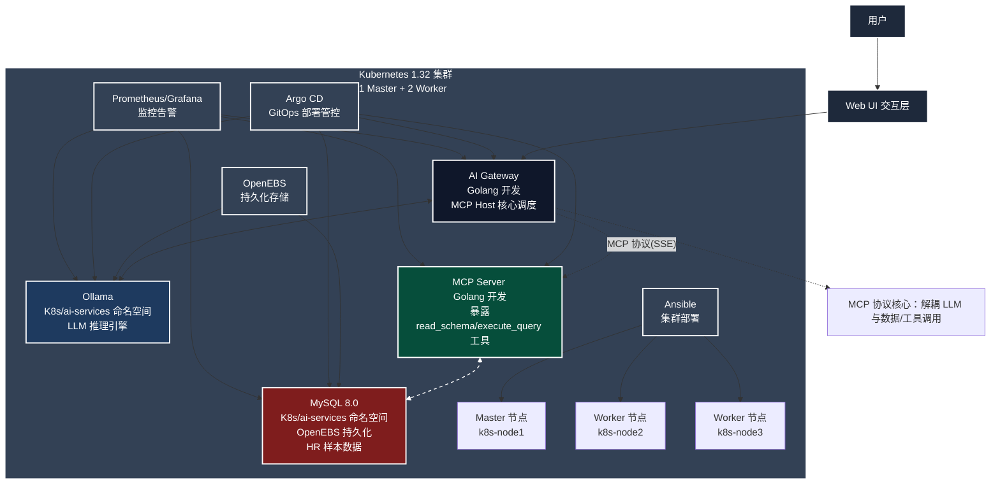

# MCP企业级AI智能体平台
一个基于MCP协议+云原生架构的私有化AI智能体平台，解决通用大模型无法安全访问内部数据的核心痛点，实现自然语言驱动的企业级业务操作自动化。

## 项目介绍
MCP企业级AI智能体平台是一款基于Anthropic MCP（Model Context Protocol）协议构建的解耦式AI智能体平台，核心设计思想是实现大模型推理层与企业内部业务执行层的安全解耦对接。在保障企业核心数据私有化的前提下，让大模型具备自主规划、执行企业级业务操作的能力，可作为企业私有化AI助手，支持自然语言驱动的内部数据库查询、业务流程执行等场景，无需将敏感数据暴露至公网大模型。

## 核心特性
- 🛡️ 私有化全栈部署：基于K8s+Ollama实现大模型推理、业务服务全私有化部署，全程不触碰公网，保障企业数据安全
- 🧩 MCP协议解耦架构：分离AI推理层（AI Gateway）与业务执行层（MCP Server），新增业务场景无需修改AI核心逻辑
- 📊 Text-to-SQL自主执行：针对HR数据查询等场景，ReAct循环引擎支持多步规划→SQL生成→执行→结果反馈全流程自动化
- ☁️ 云原生高可用：基于Kubernetes构建，具备弹性伸缩、OpenEBS持久化存储、横向扩展特性
- 🚀 GitOps生命周期管理：通过Argo CD实现声明式部署与配置管理，简化平台运维与版本迭代
- 📡 高效异步通信：基于SSE/JSON-RPC 2.0实现AI推理与业务操作的异步交互，提升响应效率

## 技术栈
### 核心技术
- Kubernetes (K8s)：容器编排与高可用运行平台
- Ollama（Qwen 2.5-7B）：本地私有化LLM推理服务，提供智能决策能力
- Golang：AI Gateway/MCP Server核心开发语言
- MCP协议：解耦大模型推理与业务操作的核心通信协议
- MySQL：企业级业务数据存储（如HR人力资源数据）
- OpenEBS：K8s持久化存储，保障数据持久化
- Argo CD：GitOps持续部署工具，实现声明式配置管理
- SSE/JSON-RPC 2.0：AI层与业务层的异步通信协议
- Docker/Containerd：容器化与镜像管理
- Helm：Kubernetes应用包管理

架构图

